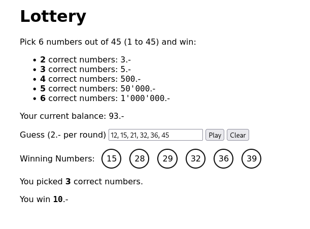

# Lottery

Bei diesem Übungsprojekt handelt es sich um ein kleines Lotteriespiel. Hiermit
sollen Sie nicht nur die Grundlagen von JavaScript lernen, sondern auch
herausfinden, warum es sich nicht lohnt Lotto zu spielen.

Das Projekt besteht im Wesentlichen aus drei Dateien:

- `lottery.html`: Die HTML-Seite, auf welcher die verschiedenen Seitenelemente
  angeordnet sind. (HTML sollten Sie bereits kennen.)
- `lottery.css`: Das Stylesheet, das der Seite ihr optisches Erscheinungsbild
  verleigt. (Auch CSS sollten Sie bereits kennen.)
- `lottery.js`: Die JavaScript-Datei, welche die eigentliche Programmlogik
  enthalten soll. (Wie man das macht, lernen Sie in diesem Modul.)

Die fertige Seite soll dann beim Spielen folgendermassen aussehen:

## Aufgabe 1: HTML und CSS betrachten

Schauen Sie sich die beiden Dateien `lottery.html` und `lottery.css` an.
Verstehen Sie alles, was darin vorkommt? **Notieren Sie sich allfällige
Fragen!**

## Aufgabe 2: Seite inspizieren

Öffnen Sie die Seite `lottery.html` in einem Web-Browser (z.B. Firefox, Chrome).
Öffnen Sie die Developer Tools. Mithilfe des _Inspectors_ können Sie nun
verschiedene Seitenelemente auswählen.

**Ermitteln Sie die `id`-Attribute der folgenden Elemente:**

- Das (leere) Eingabefeld für die Zahlen.
- Den Button mit der Aufschrift `Play`.
- Den Button mit der Aufschrift `Clear`.

Diese `id`-Attribute werden Sie beim Programmieren wieder benötigen.

## Aufgabe 3: JavaScript testen

Öffnen Sie die Datei `lottery.js` in einem Texteditor oder einer
Entwicklungsumgebung wie [Visual Studio Code](https://code.visualstudio.com/).

Die Datei ist schon soweit vorbereitet, dass nach erfolgtem Laden der Seite die
Funktion `main()` ausgeführt wird.

**Ergänzen Sie die Funktion `main()` um folgende Zeile:**

    console.log("Hello, World!");

Laden Sie nun die Datei `lottery.html` neu im Browser. Bei den Developer Tools
gibt es einen Tab namens "Console". Sie sollten hier jetzt die Meldung `Hello,
World!` zu sehen bekommen.

## Aufgabe 4: Das Eingabefeld leeren

Ein Klick auf den Button `Clear` soll den Inhalt des Eingabefelds leeren.
**Programmieren Sie diese Funktionalität.** Informationen hierzu finden Sie im
[JavaScript Tutorial](https://www.w3schools.com/js/default.asp) von
[w3schools.com](https://www.w3schools.com/):

- [DOM Elements](https://www.w3schools.com/js/js_htmldom_elements.asp)
- [JavaScript Forms](https://www.w3schools.com/js/js_validation.asp)
- [Event Listener](https://www.w3schools.com/js/js_htmldom_eventlistener.asp)

## Aufgabe 5: Das Programm entwerfen

Die eigentliche Spiellogik läuft am, wenn Schaltfläche `Play` betätigt wird.
**Beschreiben Sie den Ablauf der Logik als Liste.** Diese kann etwa
folgendermassen aussehen:

1. Die Zahlen einlesen.
    1. Die Eingabe aus dem Feld lesen.
    2. Die Eingabe anhand der Kommas trennen.
    3. …
2. Die Lottozahlen zufällig berechnen.
    1. …
3. Die getippten Zahlen mit den gezogenen Lottozahlen vergleichen.
    1. …
4. …

Beachten Sie dabei folgende Aspekte:

- Der Spieler muss sechs Zahlen zwischen 1 und 45 eingeben; jede davon darf nur
  einmal vorkommen.
- Die Lottoziehung muss sechs _zufällige_ Zahlen zwischen 1 und 45 ergeben,
  wovon jede nur einmal vorkommen darf.
- Der Spieler hat einen Kontostand ("balance"). Für jede gespielte Runde wird
  ein Betrag abgezogen; ein allfälliger Gewinn wird gutgeschrieben. Hat der
  Spieler kein Geld mehr, kann er nicht mehr spielen.
- Die Gewinnsummen sind in der Liste oben an der Seite `lottery.html`
  aufgeführt.
- Der Spieler sollte mehrere Runden nacheinander spielen können, auch mit den
  gleichen Zahlen.

## Aufgabe 6: Zahlen einlesen

Der Benutzer soll genau sechs eindeutige, durch Kommas (und optional:
Leerzeichen) voneinander getrennte Zahlen zwischen 1 und 45 (inklusive) in das
Textfeld eingeben. Beim Klick auf die Schaltfläche _Play_ sollen die vom
Benutzer eingegebenen Zahlen aus dem entsprechenden Textfeld in ein Array
abgespeichert werden.

Hierzu sind folgende Artikel hilfreich:

- [Array (MDN)](https://developer.mozilla.org/en-US/docs/Web/JavaScript/Reference/Global_Objects/Array)
- [Split (MDN)](https://developer.mozilla.org/en-US/docs/Web/JavaScript/Reference/Global_Objects/String/split)

Falls der Benutzer eine Zeichenkette eingibt, die den Anforderungen nicht
entsprechen, soll mittels `window.alert()` eine entsprechende Fehlermeldung
angezeigt werden.

## Aufgabe 7: Zufallszahlen generieren

Beim Klick auf _Play_ sollen sechs eindeutige Zufallszahlen von 1 bis 45
(inklusive) generiert und in einem Array abgespeichert werden. Verwenden Sie
hierzu die Funktion
[`Math.random()`](https://developer.mozilla.org/en-US/docs/Web/JavaScript/Reference/Global_Objects/Math/random),
welche eine Zufallszahl zwischen 0 und 1 generiert. Sie müssen die Zahl
transformieren, damit Sie im Wertebereich von 1 bis 45 zu liegen kommt.

## Aufgabe 8: Getippte mit gezogenen Zahlen vergleichen

Schreiben Sie eine Funktion, welche als Parameter die beiden Arrays der
vorherigen beiden Aufgaben akzeptiert und die Anzahl der übereinstimmenden
Zahlen dieser beiden Arrays zurückgibt. (Die Funktion muss also eine Zahl
zwischen 0 und 6 inklusiv zurückgeben.)

## Aufgabe 9: Gewinn ermitteln

Schreiben Sie eine Funktion, welche die Anzahl der korrekt getippten Zahlen
entgegennimmt und einen Gewinnbetrag nach den folgenden Regeln zurückgibt:

| Anzahl Korrekte Zahlen | Gewinn      |
|-----------------------:|------------:|
| 0                      | 0.-         |
| 1                      | 0.-         |
| 2                      | 5.-         |
| 3                      | 10.-        |
| 4                      | 500.-       |
| 5                      | 50'000 .-   |
| 6                      | 1'000'000.- |

## Aufgabe 10: Anzeige aktualisieren

Die gezogenen Lottozahlen sollen als _Winning Numbers_ dargestellt werden. Für
die Darstellung einer Lottokugel wurde die CSS-Klasse `ball` erstellt, welche
Sie verwenden können. Sie benötigen die Methode `document.createElement()` um
ein neues Element zu erstellen. Die Methoden `setAttribute()` und
`appendChild()` sowie die Eigenschaft `innerHTML` eines DOM-Nodes werden Ihnen
ebenfalls behilflich sein.

Sachdienliche Informationen finden Sie im Abschnitt [The HTML
DOM](https://www.w3schools.com/js/js_htmldom.asp) des JavaScripts-Tutorials vom
W3C.

Ist der Gewinn ermittelt, sollen die beiden Zahlen in der Anzeige _You picked
**0** correct numbers._ und _You win 0.-_ unten an der Seite mit den
entsprechenden Werten aktualisiert werden.

## Aufgabe 11: Guthaben aktualisieren

Für jeden (erfolgreich) getätigten Tipp müssen dem Spieler 2.- von seinem
Kontostand (_Your current balance: 100.-_) abgezogen werden. Hat der Spieler
einen zu geringen Kontostand, soll die Ziehung nicht durchgeführt und
stattdessen eine Fehlermeldung angezeigt werden. Gewinnt der Spieler einen
Betrag aufgrund richtig geratener Zahlen, soll dieser gutgeschrieben werden. Die
Anzeige des aktuellen Kontostands ist nach jedem Spiel zu aktualisieren.

## Aufgabe `n`: _Weitere Aufgaben folgen…_

TODO
